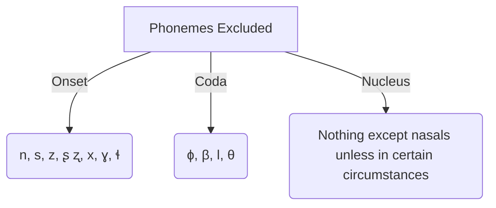

# Phonemes
## Consonants

|             | Bilabial | Dental | Alveolar | Retroflex | Palatal|Velar| Glottal |  
| ---------- | --------- |  -------| ---------| ---------| -------|-----|------------|              
| Stops|       p b       |         | t d      | ʈ ɖ      |        | k g |            |            |
| Nasals|                |         |   n      |          |        |     |            |            |   
| Taps|                  |         |   ɾ      | ɽ        |        |     |            |            |   
| Fricatives|  ɸ β       |  θ      | s z      | ʂ ʐ      |        | x ɣ | h      |            |    
|Lateral Fricative|      |         | ɬ                   |        |     |            |            |        
|Approximants|           |         | ɹ        | ɻ        | j      |     |            |            |
|Lateral Approximants|   |         |          |          | l      |     |            |            |           
 
## Vowels

|             | Front    | Central | Back |   
| ---------- | --------- | --------| ---- | 
| Close|  i               |        | u    |    
| Close-mid|              |        |      | 
|          |              | ə      |      |    
| Open-mid|  ɛ            |        |      |       
| Open|                   |        | a    |  
 

| Diphthongs |
| ---------- |
| /aɪ/ /ɛi/ /aə/ |
 

| Nasalized Vowels | 
|------------------|
|  ĩ ũ ɛ̃           |

# Orthography

## Consonants

|             | Bilabial | Dental | Alveolar | Retroflex | Palatal|Velar| Glottal |  
| ---------- | --------- |  -------| ---------| ---------| -------|-----|------------|              
| Stops|       p b       |         | t d      | ṭ ɖ      |        | k g |            |            |
| Nasals|                |         |   n      |          |        |     |            |            |   
| Taps|                  |         |   ɾ      | ɽ        |        |     |            |            |   
| Fricatives|  f v       |  th      | s z      | sh ʐ      |        | x ɣ | h      |            |    
|Lateral Fricative|      |         | ɬ                   |        |     |            |            |        
|Approximants|           |         | r        | ɻ        | y      |     |            |            |
|Lateral Approximants|   |         |          |          | l      |     |            |            |           
 

|Palatized| Labialized |
|---------| ---------- |
|dj  | dw|
## Vowels

|             | Front    | Central | Back |   
| ---------- | --------- | --------| ---- | 
| Close|  i               |        | u    |    
| Close-mid|              |        |      | 
|          |              | uh      |      |    
| Open-mid|  eh            |        |      |       
| Open|                   |        | a    |  
 

| Diphthongs |
| ---------- |
| /ay/ /ɛi/ /ah/ |
 

| Nasalized Vowels | 
|------------------|
|  ĩ ũ ɛ̃           |

# Phonotactics

## General syllable structure 

(C)(C)(C)CV(C)(C)(C)(C)(C)(V)

 

## Rules

### General Rules

1. /d/ cannot be word-initial 
2.  Lateral approximants geminate if they are word-initial
3. Voiced fricatives are unvoiced when preceded by an unvoiced stop with the exception of /v/ and /ʐ/
4. Taps and alveolar fricatives can never be word-initial consonants
5. All words must at least have an onset and a nucleus
6. Word-medial stop + nasal consonant clusters are illegal 
### Onset Rules

1. Everything except /n/, /s/, /z/, /ʂ/, /ʐ/, /x/, /ɣ/, /ɬ/
2. If there is an onset cluster
	1. The first consonant must always be a stop, fricative, or lateral approximant
	2. Following the first consonant onsets cluster up to stop + fricative + approximate
### Coda Rules

1. Everything except /ɸ, β, l, θ/
2. Codas cluster up to semivowel + approximate + fricative + stop
3. Vowels are nasalized when followed by /n/
4. The last consonant is always /n/ if the previous consonant shares the same place of articulation 

# LEXICON

## Roots

**pfehysn:** fearful, devious, full of hate
**tuhhk**: new
**lluhn:** home 
**ṭsi**: unlucky, selfish
**vtehs:** honorable, noble
**tuhysehnn**: selfless, lucky, great
**llasha**: beautiful
**bkthay**: watch
## Pronouns

**First person singular** 
-**dsheh** 
## Verb Forms

**Present Progressive**
-**keh**
-**kur** (when the verb is used in an aggressive context)

**First person singular**

**Bipersonal inflection**
-**puh**: you

Dsheh Puhbkthaykur
## Names

**Tuhhk Lluhn**: new home 
**Pfehysṭi**: Unruly and selfish one full of hate   
**Vtehsehnn**: Honorable and noble one destined for greatness
